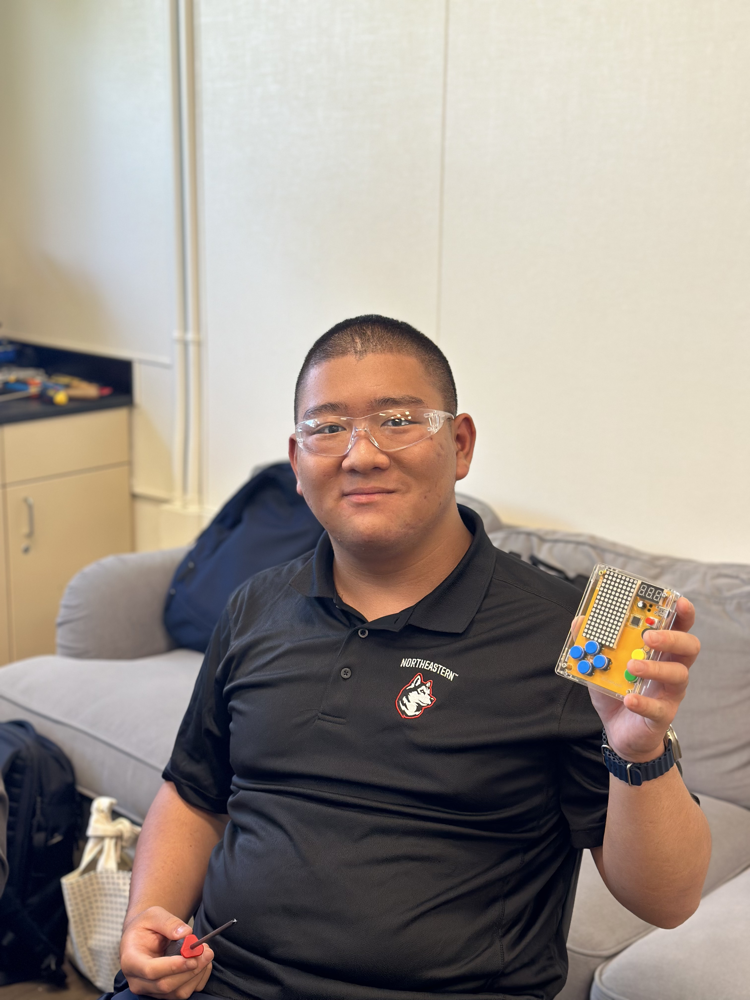

# RFID Lockbox
My intensive project is an Arduino-based, two-card RFID access controller that only unlocks when you present two distinct, authorized keycards in sequence. A MG995 servo motor physically retracts the lock cam by 90° CCW, then returns to its horizontal “rest” position. A 16×2 I²C LCD guides the user through each step (“Scan Card #1,” “Card 2 Invalid,” “Access Granted”), while an red/green LEDs deliver visual feedback for success or failure. All electronics—the MFRC522 reader, servo, display, and LEDs—share a common 5 V supply and ground, making the system reliable both on USB power and standalone battery.

| **Engineer** | **School** | **Area of Interest** | **Grade** |
|:--:|:--:|:--:|:--:|
| Jijia L. | Seven Lakes High School | Enviromental Engineering | Incoming Senior



# Modifications

<!--Video here-->
## Summary
With the addition of the 4×4 keypad, flexible UID matching, and dual-servo actuation on two separate locking cams, this prototype now delivers full two-factor security and redundant mechanical control. Under the hood, I wired and debounced a 4×4 matrix keypad into spare analog pins, echoing on the I²C LCD and gating access only after two valid card scans; Relaxed the RFID UID comparison to allow ±1-byte variance for reliable reads in noisy conditions; Added a secondary SG90 servo alongside the MG995—each driving its own lock cam—so that “Access Granted” moves both latches in unison, and the manual lock button returns both to rest; Inserted 50 ms SPI pauses and briefly disabled interrupts during RFID reads to prevent collisions with keypad scanning; Enhanced user feedback with clear LCD menus, distinct correct/incorrect chimes (G3→C4 vs. G3→C3), red/green LEDs, and a manual re-lock button.<br>

At this point, the system is fully enclosed, thoroughly tested, and ready for real-world deployment or future feature expansions like an on-device card/PIN management interface and power-saving modes.

# Final Milestone
<iframe width="560" height="315" src="https://www.youtube.com/embed/3zZ4RvGA0gg?si=Tn82DTR2EeVxfAKj" title="YouTube video player" frameborder="0" allow="accelerometer; autoplay; clipboard-write; encrypted-media; gyroscope; picture-in-picture; web-share" referrerpolicy="strict-origin-when-cross-origin" allowfullscreen></iframe>

## Summary
In the weeks since Milestone 2, I’ve fully brought together hardware, firmware, and enclosure into a polished, functioning prototype. The two-card RFID logic now runs flawlessly: after scanning each authorized UID in sequence, the latch servo unlocks and the MG995 motor snaps the tray open; the system stays unlocked until a simple push-button returns the motor to its rest position and re-locks the latch. All user-feedback elements—LCD prompts, green/red LEDs, and buzzer tones—work in concert to guide someone through each step without confusion.

## Challanges
My biggest challenge at BSE was wrestling with the RFID reader’s state machine: preventing it from “sticking” on the first tag and learning to reinitialize it correctly after card removal. Overcoming that quagmire felt like a real triumph, and it taught me the value of methodical, blocking-vs-nonblocking I/O patterns in embedded code. Another highlight was designing and fitting all components into a single enclosure—measuring, bracket-prototyping in CAD, and iterating until every module had its perfect home without wires catching or servos binding.

## What did I learn
Through this project I’ve deepened my understanding of RFID communication (MFRC522 library quirks, UID parsing, reader resets); I²C peripherals (LCD backpack setup, contrast tuning, address scanning); Servo control (precise angle mapping, power-bank decoupling, timing with millisecond vs. delay for a certain amount of time); Stateful UI design (LCD prompts, LED/buzzer feedback, push-button state machines)<br>

Looking ahead, I’m excited to explore more advanced topics in embedded systems—secure over-the-air firmware updates, wireless keycards (BLE/NFC), low-power optimization, and encrypted authentication. The foundation I’ve built at BSE gives me confidence to tackle networked IoT devices and professional-grade access controllers in the future.

# Second Milestone
<iframe width="560" height="315" src="https://www.youtube.com/embed/fDCb2J9xpOk?si=-7EMGv_uoDvhrFOk" title="YouTube video player" frameborder="0" allow="accelerometer; autoplay; clipboard-write; encrypted-media; gyroscope; picture-in-picture; web-share" referrerpolicy="strict-origin-when-cross-origin" allowfullscreen></iframe>

## Summary
For my second milestone, I dedicated my time entirely to fleshing out the core authentication code and user‐feedback routines that ties every component together. First, I integrated the MFRC522 library and wrote a robust readCard() helper that blocks until a tag is present, reads its 4-byte UID into a buffer, and halts the reader cleanly. I then built an isAuthorized() function that compares that buffer against a hard-coded list of allowed UIDs. To ensure the two-card requirement, I added logic to store the first UID, wait until that tag is removed (polling PICC_IsNewCardPresent() until it’s gone), and then loop until a second, distinct authorized UID is presented.

On top of that, I encapsulated all user messaging in a single showMessage() routine that both writes to the I²C LCD and echoes the same text over Serial. This proved invaluable for headless debugging, as I could watch every state transition (“Card 1 OK,” “Please Scan Card #2,” etc.) in parallel with the display. I also implemented the LED and buzzer feedback: the red LED now pulses on any invalid scan, while Green #1 lights immediately after a valid first card and Green #2 comes on only when the second card passes. All of these signals persist exactly until the next state, then clear together when access is finally granted.

## Challanges
One surprise came from handling the reader’s “card still present” state: without the removal loop, the reader would stubbornly keep detecting the same first card and never advance to the second step. Resolving that took careful testing of PICC_IsNewCardPresent() and small delays to avoid rapid re-triggers. I also wrestled with library quirks—like needing to call PCD_Init() and PICC_HaltA() in just the right places to prevent lock-ups—and ironed out several off-by-one bugs in the UID comparison loops.

## What's next
For the final milestone, my next step is purely mechanical integration: I’ll begin by carefully measuring the box’s interior and mapping each module’s footprint—the Arduino Uno, MG995 servo, MFRC522 antenna, I²C LCD, buzzer and LEDs—onto its walls and floor. I’ll design and fabricate simple mounting plates or brackets (using laser-cut acrylic or 3D-printed parts) to secure each component in place, then cut or drill the necessary openings for the servo arm, card swipe slot, display window and wiring harness. Simultaneously, I’ll carve out or add thin partition walls to create small trays or shelves for storing extra keycards, fobs or notes, ensuring these storage bays don’t interfere with any moving parts or cable runs. Once the brackets and cutouts are prototyped, I’ll assemble everything inside the box, verify clearances and cable management, and finalize the layout so the completed unit is both fully functional and offers convenient internal storage.

# First Milestone
<iframe width="560" height="315" src="https://www.youtube.com/embed/M0pmq5avC0Q?si=Eaqc1bn8x1eadtzN" title="YouTube video player" frameborder="0" allow="accelerometer; autoplay; clipboard-write; encrypted-media; gyroscope; picture-in-picture; web-share" referrerpolicy="strict-origin-when-cross-origin" allowfullscreen></iframe>

## Summary
For my first milestone, I completed the construction and wiring of the core components that make up the locking function of the project. I mounted an Arduino UNO R3 (with its servo‐driver extension shield) in its enclosure and soldered the header for the MG995 servo onto the board. I then ran a dedicated 5 V supply line—complete with a 470 μF decoupling capacitor—to the servo’s red and brown leads, and connected its control wire to digital pin 6. With this hardware in place, I was able to upload a simple sweep sketch that reliably moves the servo arm between its horizontal “rest” position and the 90° CCW “active” position needed to retract the lock.

On the software side, I have verified that the MG995 will consistently hit both its start-and-end angles when powered from both USB and battery sources. To eliminate voltage sag during motion, I tested the system on a USB power bank and observed stable performance once the capacitor was in place. I also established a common ground between the Arduino and the external supply, ensuring the servo and controller share a reference. These early tests give me confidence that the locking mechanism will operate smoothly under standalone battery power.

## Challanges
The primary challenges will be integrating the MFRC522 RFID reader and implementing the two-card authentication logic without mechanical interference. I will need to calibrate the servo angles in situ—tweaking the MOTOR_REST_ANGLE and MOTOR_ACTIVE_ANGLE constants in code—so that the lock cam aligns precisely with its strike plate. I also need to design a tidy mounting scheme for the RFID antenna inside the enclosure and route all wiring so that nothing catches when the servo moves. Finally, I’ll test reliability over hundreds of cycles to guard against wear or binding.

## What's next
Looking ahead from this hardware‐focused first milestone, my very next steps are pure firmware work: I will integrate the MFRC522 library and write the dual‐card authentication routine that reads, buffers, and compares two distinct UIDs in sequence; build a state-driven showMessage() API that drives the I²C LCD and echoes states over Serial; implement the LED and buzzer signaling logic so that green LED#1 lights on a valid first card, green LED#2 only after the second, and the red LED and error tones fire on any invalid scan; and tie it all together with clean, nonblocking loops that halt and reinitialize the reader correctly between scans. Completing this coding phase will prove the full access-control flow before I move on to final refinements and enclosure design.

# Starter Project

<iframe width="560" height="315" src="https://www.youtube.com/embed/q2iCdOoT5WA?si=4jDJQshDIgnvTNb1" title="YouTube video player" frameborder="0" allow="accelerometer; autoplay; clipboard-write; encrypted-media; gyroscope; picture-in-picture; web-share" referrerpolicy="strict-origin-when-cross-origin" allowfullscreen></iframe>

## Summary

For my starter project, I chose the Retro Gaming Console. This device recreates the gaming console from a few decades ago, including games like Tetris, Snake.io, Plane Racing, Space Defender and a Slot Machine. Each game utilizes the inputs from the D-Pad style buttons for diffrent functions, as well as the green and yellow button for confirming and pausing/quitting the game. The music changes depends on what game was played, as well as what was displayed on the 7-segment display. The whole device is powered by 3 AAA batteries, or it could be powered via USB-B connection. There's also some options to adjust the brightness levels and the volume.<br>

## Challanges
During the process of constructing the console, the biggest challenge for me was to not accidentally solder two joints toghether, as that could create a short between them. But because I've soldered a lot before, this wasn't a huge issue for me, I just slowed down and was more careful, and the soldering turned out great with everything working as it should. But the real issue that prevented me from completing the project easily was the unclear instruction. The phamplet included in my kit are missing some of the crutial steps like where to solder the wires to, which direction each conponent should face, and what types of wiring should you use. In the end, I figured out how each will work toghether and where they would go by looking up info online, and asking my friends for advices.

# How it works
I used a LED Matrix x2, 7 Segment Display, Buzzer, Button x7, Capacitor, Battery holder, AAA Battery x3, Transparent Acrylic Shell x 6, ICM (Intergrated Circuit Processor), and PCB. The ICM processes the inputs from the 7 buttons/switches and outputs to the screen and 7-segment display.


# Schematics 
<!---Tinkercad](https://www.tinkercad.com/blog/official-guide-to-tinkercad-circuits) and [Fritzing](https://fritzing.org/learning/)-->
<br>
An schematic of the internal conponents (The wiring to the large breadboard is the wiring to the RFID reader).

# Code
```c++
/* —— Authorized UIDs —— Just a copy of all the authorized cards, so I don't have to re-type it everytime
byte cards[][10] = {
  {138,  63,   230,   63},
  {160, 170,  22,   8},
  {165, 63,   230,  63},
  {189 ,87,  203,  145},
  {138,56,8,5},
  {167,63,230,63}
};*/


#include <Wire.h>
#include <LiquidCrystal_I2C.h>
#include <SPI.h>
#include <MFRC522.h>
#include <Servo.h>

// —— Pins ——
#define SS_PIN           10   // RFID SS
#define RST_PIN           9    // RFID RST (wired to Arduino D9)
#define LOCK_PIN          3    // latch‐servo
#define MG995_PIN         6    // MG995 motor‐servo
#define SG90_PIN          A1   // SG90 motor‐servo
#define BUZZER_PIN        8    // active buzzer
#define LED_RED_PIN       7    // error LED
#define LED_GREEN1_PIN    2    // card1 OK
#define LED_GREEN2_PIN    4    // card2 OK
#define BUTTON_PIN        5    // one leg → D5, other → GND

// —— Servo angles & timing ——
const uint8_t   MOTOR_REST_ANGLE    = 90;
const uint8_t   MOTOR_ACTIVE_ANGLE  = 180;
const uint8_t   SG90_ACTIVE_ANGLE   = 0;    // inverted direction for SG90
const unsigned long MOTOR_HOLD_MS   = 2000;

// —— I²C LCD ——
LiquidCrystal_I2C lcd(0x27, 16, 2);

// —— RFID reader & servos ——
MFRC522 rfid(SS_PIN, RST_PIN);
Servo    lockServo, motorMG995, motorSG90;

// —— Authorized UIDs ——
byte cards[][10] = {
  {138,  63,   230,   63},
  {160, 170,  22,   8},
  {165, 63,   230,  63},
  {189 ,87,  203,  145},
  {138,56,8,5},
  {167,63,230,63}
};

bool unlocked = false;
bool unlockMsgShown = false;

void setup() {
  Serial.begin(9600);
  Wire.begin();
  SPI.begin();

  // force‐reset MFRC522
  pinMode(RST_PIN, OUTPUT);
  digitalWrite(RST_PIN, LOW);
  delay(50);
  digitalWrite(RST_PIN, HIGH);
  delay(50);
  rfid.PCD_Init();

  // latch‐servo
  lockServo.attach(LOCK_PIN);
  lockServo.write(5);  // locked start

  // MG995 servo
  motorMG995.attach(MG995_PIN);
  motorMG995.write(MOTOR_REST_ANGLE);

  // SG90 servo (inverted)
  motorSG90.attach(SG90_PIN);
  motorSG90.write(MOTOR_REST_ANGLE);

  pinMode(BUZZER_PIN, OUTPUT);
  pinMode(LED_RED_PIN,    OUTPUT);
  pinMode(LED_GREEN1_PIN, OUTPUT);
  pinMode(LED_GREEN2_PIN, OUTPUT);
  digitalWrite(BUZZER_PIN, LOW);
  digitalWrite(LED_RED_PIN,    LOW);
  digitalWrite(LED_GREEN1_PIN, LOW);
  digitalWrite(LED_GREEN2_PIN, LOW);

  pinMode(BUTTON_PIN, INPUT_PULLUP);

  lcd.init();
  lcd.backlight();
  showMessage("Please Scan", "Card #1");
}

void loop() {
  // — Manual re‐lock block —
  if (unlocked) {
    if (!unlockMsgShown) {
      showMessage("Press Button", "to Lock");
      unlockMsgShown = true;
    }
    if (digitalRead(BUTTON_PIN) == LOW) {
      delay(50);
      while (digitalRead(BUTTON_PIN) == LOW) delay(10);

      // Return both servos to rest
      showMessage("Locking", "Please Wait");
      delay(1000);
      motorMG995.write(MOTOR_REST_ANGLE);
      motorSG90.write(MOTOR_REST_ANGLE);
      tone(BUZZER_PIN, 1000, 100);

      // Reset LEDs & state
      digitalWrite(LED_GREEN1_PIN, LOW);
      digitalWrite(LED_GREEN2_PIN, LOW);
      unlocked = false;
      unlockMsgShown = false;

      delay(500);
      showMessage("Please Scan", "Card #1");
    }
    return;
  }

  byte uid1[4], uid2[4];

  // — Card #1 —
  showMessage("Please Scan", "Card #1");
  readCardBlocking(uid1);
  exportUID(uid1, 4);
  if (!isAuthorized(uid1)) {
    indicateWrong();
    deny("Card 1 Invalid");
    delay(500);
    return;
  }
  digitalWrite(LED_GREEN1_PIN, HIGH);

  showMessage("Card 1 OK", "Remove Card");
  delay(1000);
  waitForRemoval();

  // — Card #2 —
  while (true) {
    showMessage("Please Scan", "Card #2");
    readCardBlocking(uid2);
    exportUID(uid2, 4);
    if (!isAuthorized(uid2)) {
      indicateWrong();
      deny("Card 2 Invalid");
      continue;
    }
    if (memcmp(uid1, uid2, 4) == 0) {
      indicateWrong();
      deny("Same Card");
      continue;
    }
    digitalWrite(LED_GREEN2_PIN, HIGH);
    showMessage("Card 2 OK", "");
    delay(1000);
    break;
  }

  // — Grant access & enter manual‐relock mode —
  showMessage("Access Granted", "");
  tone(BUZZER_PIN, 1000, 300);
  delay(300);

  // Open latch
  lockServo.write(90);
  delay(500);

  // Move MG995 and SG90 (inverted)
  motorMG995.write(MOTOR_ACTIVE_ANGLE);
  motorSG90.write(SG90_ACTIVE_ANGLE);
  delay(MOTOR_HOLD_MS);

  unlocked = true;
}

// — Helpers —

void readCardBlocking(byte buf[4]) {
  while (!rfid.PICC_IsNewCardPresent()) delay(50);
  if (rfid.PICC_ReadCardSerial()) {
    memcpy(buf, rfid.uid.uidByte, 4);
    rfid.PICC_HaltA();
  }
}

void waitForRemoval() {
  while (rfid.PICC_IsNewCardPresent()) delay(50);
  delay(200);
  rfid.PCD_Init();
}

bool isAuthorized(byte uid[4]) {
  for (size_t i = 0; i < sizeof(cards)/sizeof(cards[0]); i++)
    if (memcmp(cards[i], uid, 4) == 0) return true;
  return false;
}

void showMessage(const char* l1, const char* l2) {
  lcd.clear();
  lcd.setCursor(0,0); lcd.print(l1);
  lcd.setCursor(0,1); lcd.print(l2);
  Serial.print(l1);
  if (*l2) { Serial.print("  |  "); Serial.print(l2); }
  Serial.println();
}

void indicateWrong() {
  digitalWrite(LED_RED_PIN,    HIGH);
  digitalWrite(LED_GREEN1_PIN, LOW);
  digitalWrite(LED_GREEN2_PIN, LOW);
}

void deny(const char* msg) {
  showMessage(msg, "");
  // two short beeps
  for (int i = 0; i < 2; i++) {
    digitalWrite(BUZZER_PIN, HIGH);
    delay(100);
    digitalWrite(BUZZER_PIN, LOW);
    delay(100);
  }
  // brief pause before red LED timeout
  delay(800);
  // keep red LED on for 3 seconds total
  delay(3000);
  digitalWrite(LED_RED_PIN, LOW);
}

void exportUID(byte uid[], byte len) {
  Serial.print("UID DEC: ");
  for (byte i = 0; i < len; i++) {
    Serial.print(uid[i], DEC);
    if (i < len - 1) Serial.print(',');
  }
  Serial.println();
  Serial.print("UID HEX: ");
  for (byte i = 0; i < len; i++) {
    if (uid[i] < 0x10) Serial.print('0');
    Serial.print(uid[i], HEX);
    if (i < len - 1) Serial.print(':');
  }
  Serial.println();
}
```

# Bill of Materials
<!---Here's where you'll list the parts in your project. To add more rows, just copy and paste the example rows below.
Don't forget to place the link of where to buy each component inside the quotation marks in the corresponding row after href =. Follow the guide [here]([url](https://www.markdownguide.org/extended-syntax/)) to learn how to customize this to your project needs. -->

| **Part** | **Note** | **Price** | **Link** |
|:--:|:--:|:--:|:--:|
| ELEGOO UNO R3 Project Super Starter Kit| The core conponents for the project | $35.99 | <a href="https://a.co/d/9hBT6cX"> Link </a> |
| SunFounder Reader Module Kit Mifare RC522 Reader Module | An Arduino-compataibile RFID module | $8.99 | <a href="https://a.co/d/eX8J4wL"> Link </a> |
| YAMASO 20PCS L Bracket Corner Bracket with 60PCS Screws | Creating the structure and fastening the pieces toghether | $5.99 | <a href="https://a.co/d/65ODQW2"> Link </a> |
| Wooden Box | Container | $21.99 | <a href="https://a.co/d/elA4GaO"> Link </a> |
| 5 AA Battery Holder with Wires | Provides power for the system | $7.99 | <a href="https://a.co/d/0rVpuwI"> Link </a> |
| 4*4 Keypad | A form of authentication | $10.99 | <a href="https://www.adafruit.com/search?q=keypad&p=1"> Link </a> |

# Other Resources/Examples
Here's some links to the resources that helped me construct this project.
- [RFID Module Help](https://www.digikey.com/en/maker/projects/how-to-make-an-arduino-based-rfid-box-lock/a57d9f8ad28043d1b56acbd34d8a55de)
- [Similar Concept-Biometric + Keypad Lockbox](https://sviatil0.github.io/Sviatoslav_BSE/](https://gracewanggg.github.io/Grace_BSE_Portfolio/))
- [ChatGPT-RFID Lockbox Help](https://chatgpt.com/share/687182d3-db38-8002-b1a7-1da8e7cc0692)
- [Wiring the RFID To The Arduino](https://www.instructables.com/Arduino-MFRC522-RFID-READER/)
